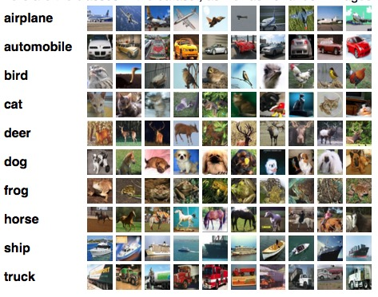
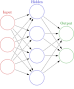

# Report Draft

## ABSTRACT

This is the midterm report for project of Introduction to Machine Learning(10-601, Fall 2015). In this project, we perform several machine learning method to classify images on the CIFAR-10[1] database. Conducted by an empirical study, the goal is to investigate the performance of different classifiers with different features and Principle Component Analysis(PCA). We also test deep learning algorithm with unsupervised feature extraction. Currently, by using neural network with hog feature, we can obtain a testing accuracy of 52%, which is 4% higher than the baseline implementation.

### Keywords

Naive Bayes, HOG, PCA

---

## 1.INTRODUCTION

Classifying images to different categories is the main focus for automatic recognition. In order to achieve higher precision, various methods of computer vision are proposed. Nowadays, deep learning is one of the most popular and effective machine learning techniques in this domian because of its ability of modeling image data with high-level abstractions[2]. The number of dimensions of deep learning algorithm can be extremely large which is barely possible for human to understand. However, traditional computer vision features such as GIST, Scale-invariant Feature Transform(SIFT), Speeded Up Robust Features(SURF), HOG are also significant for accurately image classification. Instead of using the raw pixel data, the features mentioned above can capture different structures such as edges, lines, orientations, etc[3].

As the main focus of these project is to test different machine learning algorithms, the precision of classification will not be the only criteria of the project. Instead, we will use different features to evaluate the performance of Logistic Regression, Naive Bayes, Neural Network and Support Vector Machine. Besides, we also use Principle Component Analysis(PCA) to reduce the dimensions of featrues to improve accuracy. In order to find the best parameter for each machine learning algorithm, we tuned the parameters with many options and then compare their performance.

Another work for this project is building a data preprocessing pipeline so as to eliminate outliers in the training data. The idea of this method is to use better training data to get better classifier. So we cover all three factors that may affect the precision of classification. Data preprocessing contribute to better training data. Different feature extraction and PCA method contribute to more effective descriptor. Testing different machine learning algorithm can find the best machine learning technique that meets our needs.

---

## 2.BACKGROUND

This section introduce the dataset, feature and machine learning algorithm related to this project. 

### 2.1.Dataset

The CIFAR-10 is a labeled subset of 80 million tiny images which consists of 60000 32x32 color images in 10 classes, with 6000 per class. There are 50000 training images and 10000 test images. Below is a random sample from the CIFAR-10 with 10 random images from each class.

### 2.2.HOG feature

In computer vision, it is critical to find proper visual features so that complex tasks can be performed. In this project, it is better to use the features of the image as they are more decriptive than the raw image pixel. Compared with SIFT which captures the properites at key points, HOG describes the shapes of a given region in a broader scope[5,6]. Also, HOG is typically used in a sliding window fashion in object detection systems. The images in CIFAR-10 are quite small(32x32) so it may be better to use HOG in this project.

### 2.3.SIFT feature

SIFT computes the gradient histogram only for patches (usually 16*16 divided into 16 cells) around specific interest points obtained by taking the DoG's (as an approximation to LoG's) in the scale space. It is a local descriptor which makes it perform bad when the input images are small.

### 2.4.GIST feature

GIST is typically computed over the entire image (i.e. it is a global image descriptor) for the purposes of scene classification. The idea is similar to HOG which focus on the global feature rather than the key points. So it is also a good choice to use GIST features.

### 2.5.Logistic Regression

Logistic regression is one of the most useful linear classifier in machine learning. Logistic regression measures the relationship between the categorical dependent variable and one or more independent variables by estimating probabilities using a logistic function, which is the cumulative logistic distribution. The logistic function is shown below:

$$
a = \frac{1}{1+exp(-b)}
$$

We can use Maximum Conditional Likelihood Estimation(MCLE) to train the model.

### 2.6.Neural Network

Unlike logistic regression, neural network with multiple hidden layers can be regarded as non-linear classifier. It has been proven to be powerful in many domains especially image classification. Typically, a neural network can be composed of a large number of interconnected computing elements in roder to learn high level features from the inpute layer. An example of the structure of a neural network is shown below:

However, neural network cannot provide a explicit learning process of its hidden layers. In order to find the best parameters, we usually increase the number of hidden layers which takes more time to train the neural network. After comparing the performance under different parameters, we can select the best neural network model.

### 2.7.Support Vector Machine

SVM is a discriminative training process of linear classifier by maximizing the margin hyperplane of classification[4]:

$$
f(x)=\sum_{i=1}^{L}\alpha_it_iK(\mathbf{x},\mathbf{x}_i)+d_i 
$$

As CIFAR-10 dataset contains 10 different classes, we need to use the multi-class SVM to classify the images. Using kernel functions, SVM can often find the proper linear sperarable hyperplane in higher dimension while the data is not linear separable originally. We have tested several kernal function and it turns out that the Radial Basis Function(RBF) kernel performs better in this project.

$$
K(\mathbf{x}_i,\mathbf{x}_j)=exp(-\gamma||\mathbf{x}_i-\mathbf{x}_j||^2),\gamma > 0
$$

Here $\gamma$ is the kernel parameter. The optimal value of $\gamma$ should be selected by cross validation method.

### 2.8.Principla Component Analysis(PCA)

PCA refers to a specific form of dimension reduction where the principle components are drawn on the sequentially orthogonal axes of the largest variance. It provides a way to reduce dimensionality without losing too much information[5]. With the help of PCA, we can build a model without redundant or irrelevant features.

---

## 3.METHODS

TODO

---

## 4.RESULTS

TODO

---

## 5.CONCLUSION

TODO

---

## 6.ACKNOWLEDGMENTS

TODO

---

## 7.Reference

[1] Alex, K. 2009. Learning multiple layers of features from tiny images

[2] Honglak, L., Roger, G., Rajesh, R., and Andrew Y. Ng. 2009. Convolutional deep belief networks for scalable unsupervised learning of hierarchical representations. ICML'09,609-616

[3] Andreal, V., and Brian, F. 2010. Vlfeat: an open and portable library of computer vision algorithms. ACM, New York, NY 2010, 1469-1472

[4] Leslie, C., Eleazar, E., and Stafford, W., 2001. The spectrum kernel: A string kernel for SVM protein classification. Pacific Symposium on Biocomputing. 566-575

[5] Morre, B., 2009. Principal component analysis in  linear systems: Controllability, observability, and model reduction. Automatic Control, IEEE Transactions on Vol. 26. Issue. 1.

